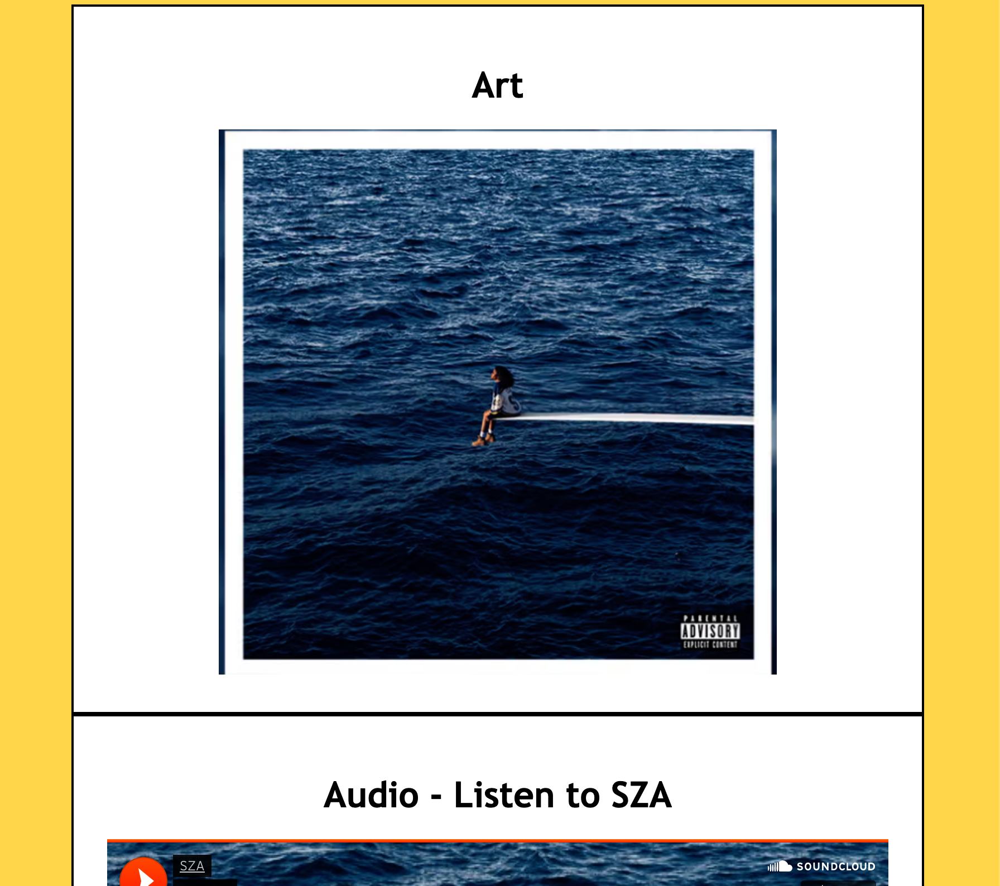
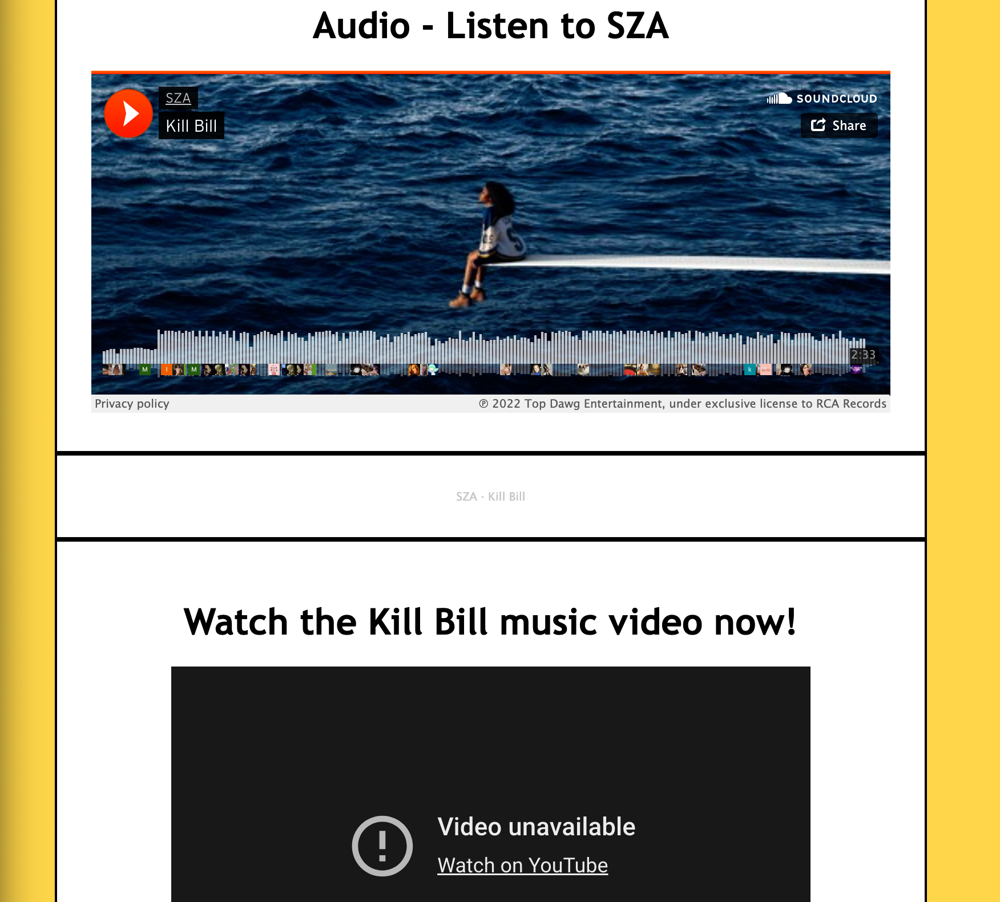
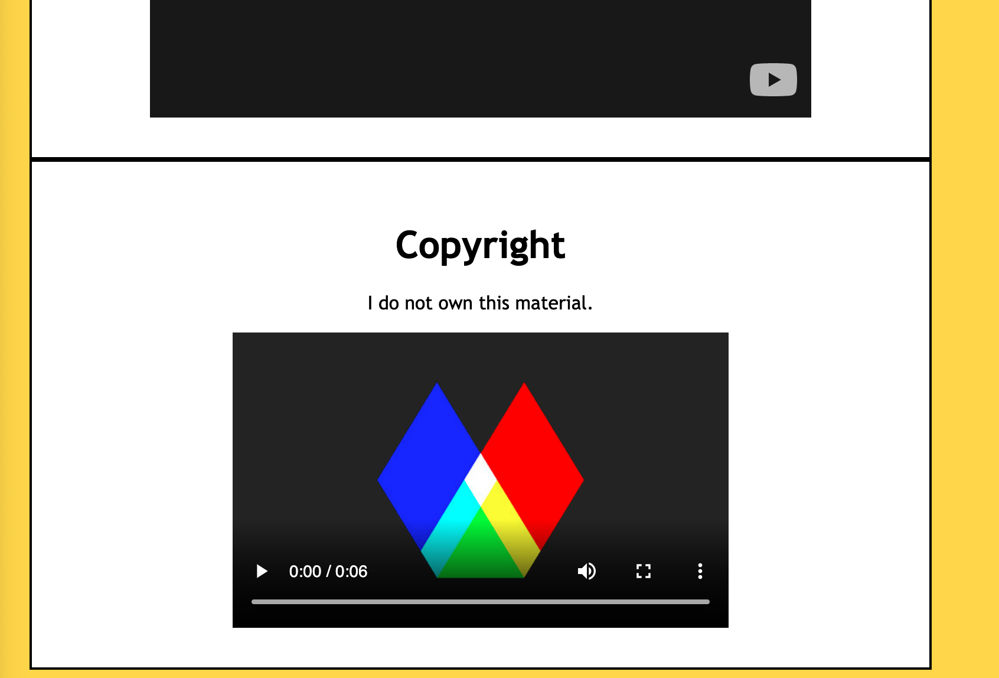

An affordance is almost the purpose or possibilites of an object, button, anything really. In media or webistes, affordance is an actionable interaction. Meaning a button that you click, creating a profile, ect. 
The advantage of using a third-party service is that you have almost unlimited access to videos or media of your choice. A disadvantage is copyright issues may limit you to use of certain media. 
I had a hard time uploading my youtube video to my webpage, everytime I tried uploading a related video it had "unable to play" errors. Im not sure if the issue is a copyright issue due to SZAs rights on those videos but I tried uploading covers, lyric videos, ect. and nothing would work. I wasnt able to overcome this issue unfortunatly and im interested to hear what you have to say. 

