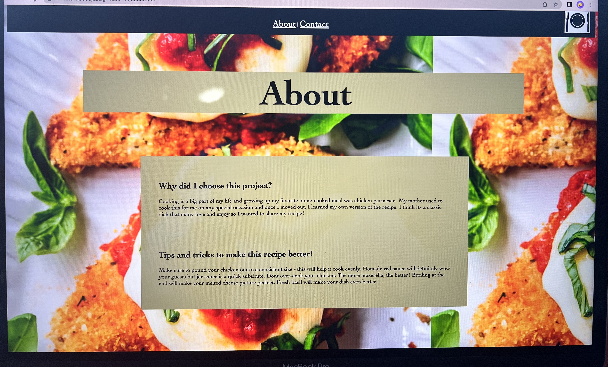
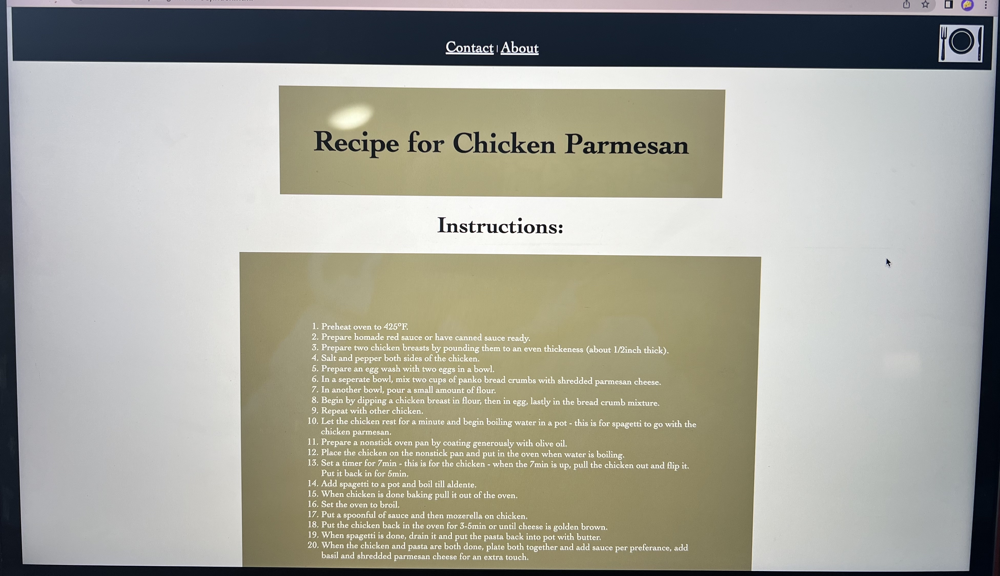
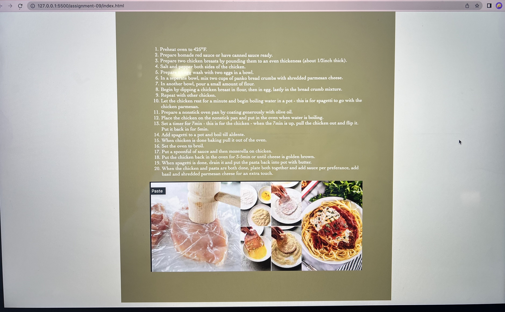
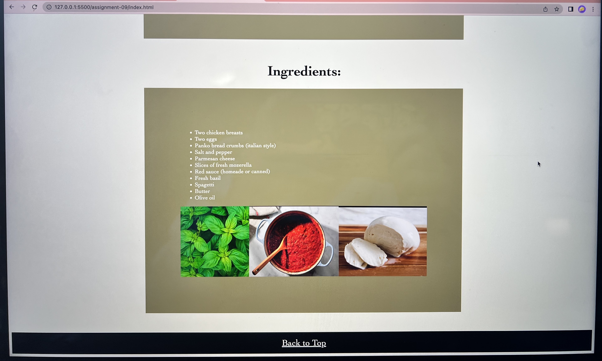
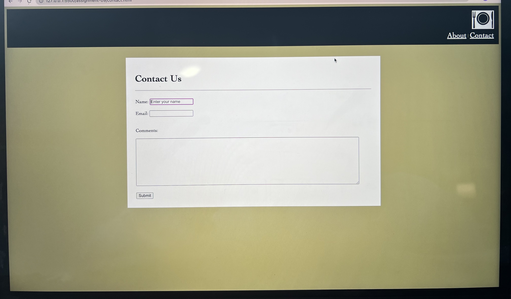

Learning in HTML was definitely an experience. Coming into this I had no previous experience with this type of language and code, I would also say my computer skills are limited, which is part of the reason I wanted to take this class. It was difficult to learn the rules and style of HTML at first, but the rules stay the same so it became easier to follow along. I loved learning about all the syle elements and adding colors to the sites, this came easier. I struggled with adding images for awhile but I now understand that too. I think that understanding the sizing elements is harder and something i havent fully grasped but did well in with this assignment. 

I am really excited to get into the design element with CSS! Being and art major, this is my strong suit and im ready to apply it to this. I am anxious for translating art elements into code language but I am also intrigued. 

